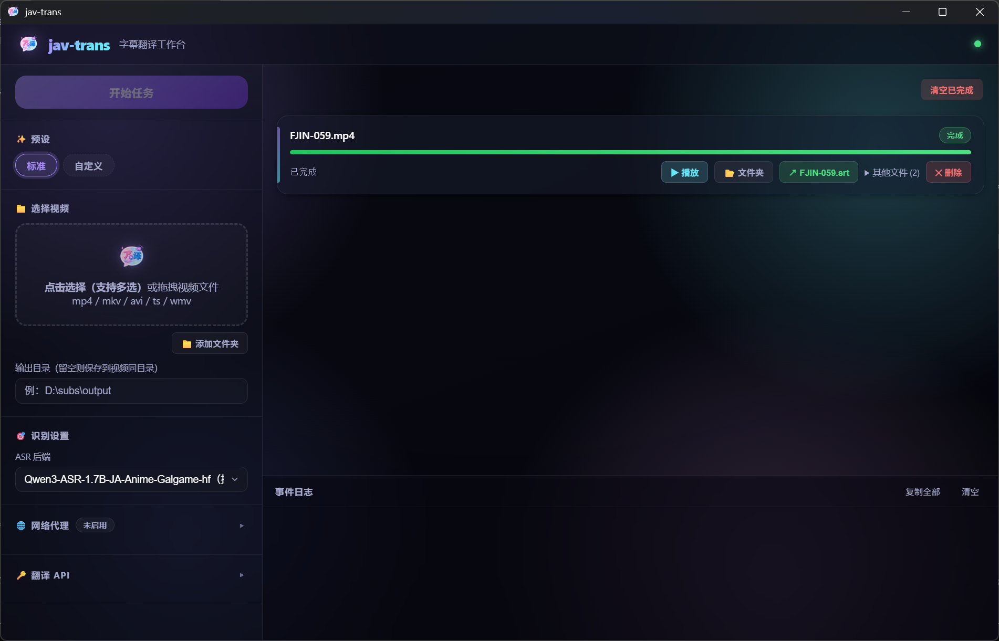

# jav-trans

jav-trans 是一个面向 Windows + NVIDIA 显卡的本地 JAV 字幕生成工具。它把视频处理成日文字幕、中文字幕或中日双语字幕，并把音频准备、语音岛检测、内部切分、Pre-ASR CueQC、Qwen ASR、字幕时间轴、LLM 翻译和质量报告串成一条本地优先的流水线。

项目目标：本地完成视频、音频、边界切分、ASR 和字幕时间轴重计算；LLM 只负责翻译、术语一致和口吻连贯，不负责脑补剧情或修正 ASR 误听。

致谢：[WhisperJAV](https://github.com/a63n/WhisperJAV) 为本项目早期路线提供了重要参考。

---

## 界面预览



任务提交、实时阶段进度、显存/耗时监控和质量报告都在本地网页控制台完成。更多截图放在 `docs/images/`。

---

## 项目背景

本项目的边界系统不是传统 VAD。目标不是单纯判断“有没有人声”，而是生成适合字幕和 ASR 的 speech-core chunk：尽量接近一句台词一个 chunk，避免把 BGM、环境声、贴连短句或长独白粗暴混成同一种情况。

当前设计把职责拆开：

- Speech Island Scorer 以高召回检测可能包含语义人声的 island。
- Outer Edge Refiner v3 预留为整条 island 的外边界模型；架构、数据和人工 gate 回看完成前仅为不可执行占位。
- Acoustic Split v4 只学习 `cut/continue`，按二分类 argmax 生成内部 event，不输出最终边缘；teacher/data 层的 `unsure` 仅用于审计并从训练排除。
- Pre-ASR CueQC v13 对 provisional sub-island 做 `keep/drop` 二分类 argmax 路由；teacher/data 层可以保留 `unsure`，但模型不会输出它。
- Inner Edge Refiner v2 对 CueQC 保留的 sub-island 做逐帧二分类 argmax，裁成送入 ASR 的 acoustic semantic core。
- 字幕 layout 只处理显示规则，不反向修改 ASR chunk 语义。

这样做是为了避免一个模型同时承担“找语音、切句、删噪声、修边界、做字幕排版”。设计演进、实验记录、失败路线和更新记录都放在 [docs/HISTORY.md](docs/HISTORY.md)。

---

## 快速开始

本仓库和 GitHub Releases 仅维护源码、测试、必要 checkpoint、release notes 与版本说明。打包器、打包配置和二进制发布产物不进入远端仓库。

### 源码运行

推荐环境：

- Windows 10/11。
- NVIDIA 独立显卡和较新的驱动。
- Python 3.13+。
- FFmpeg Shared（TorchCodec 需要 FFmpeg 共享 DLL），并确保命令行能直接执行 `ffmpeg`。
- Git。

Windows 请安装 Shared 版。不要同时保留会优先占用 `PATH` 的 `Gyan.FFmpeg`
静态版：

```powershell
winget uninstall --id Gyan.FFmpeg --exact
winget install --id Gyan.FFmpeg.Shared --exact

# 关闭并重新打开终端后验证：应指向 full_build-shared\bin
where.exe ffmpeg
Get-ChildItem (Split-Path (Get-Command ffmpeg).Source) -Filter "avcodec-*.dll"
```

如果 `where.exe ffmpeg` 仍列出多个版本，请确保
`Gyan.FFmpeg.Shared\...\full_build-shared\bin` 排在 `PATH` 最前，随后重启
jav-trans。仅有 `ffmpeg.exe` 还不够；其目录必须同时存在
`avcodec-*.dll`、`avformat-*.dll` 和 `avutil-*.dll`。

项目安装：

```powershell
git clone https://github.com/jaykwok/jav-trans.git
cd jav-trans

uv venv
uv pip install --upgrade pip
uv pip install torch torchaudio --index-url https://download.pytorch.org/whl/cu128
uv pip install -r requirements.txt
```

Qwen3-ASR 原生支持要求 `transformers>=5.13.0`（由 `requirements.txt` 安装）。

启动网页控制台：

```powershell
$env:PYTHONIOENCODING="utf-8"
uv run --no-sync python launcher.py
```

默认地址为 `http://127.0.0.1:17321`。首次运行可以没有 `.env`；打开页面后在“翻译 API”面板填写 API Key、Base URL、模型和目标语言，保存或开始任务时会自动写入项目根目录 `.env`。新建的 `.env` 只启用实际保存的本机值，ASR batch、后端、显存预算等研究项会以注释示例形式写入。国内网络下载 Hugging Face 模型较慢时，可在“识别设置”里填写代理协议、地址和端口。

Web 提交是否使用 CUDA 取决于后端服务进程是否能看到 GPU，而不是浏览器本身。完整 SpeechBoundary-JA / ASR smoke 应确认日志中出现 `cuda_available=True`、`device=cuda:0` 或 `actual_device=cuda`。
Web 会在模型要求检查中提示驱动过旧或 CUDA 初始化失败。

---

## 使用流程

1. 打开网页控制台。
2. 选择视频文件。
3. 选择字幕模式、ASR 后端和翻译设置。
4. 选中的视频会立即进入右侧“待开始”列表；确认后点击“开始任务”。
5. 在输出目录查看 SRT、质量报告和日志。

任务正常完成后会保留可复用的 Boundary cache；从右侧任务列表删除已结束任务时，会同时清理该视频的全部 Boundary cache 变体、未完成的 ASR checkpoint 和任务临时目录。运行中的任务第一次删除只执行取消，进入“已取消”后再次删除才会清理缓存。

勾选“不翻译（仅日文字幕）”时，流水线仍会执行边界规划、可选 Pre-ASR CueQC、ASR 和 Boundary chunk 字幕时间轴生成，但跳过 LLM 翻译，最终输出 `<视频名>.ja.srt`。这是验证本地边界 / ASR / 字幕时间轴链路的推荐 smoke 模式。

---

## 完整工作流

```text
视频输入
  -> 任务上下文 / 配置解析
  -> 音频抽取与标准化
  -> Shared Qwen feature extraction
     - Qwen ASR repo 对应的 frozen PTM/encoder frame features
     - MFCC / timing numeric features
  -> SpeechIslandScorer v8
     - 仅输出 dense speech_prob
     - speech hysteresis 生成高召回 speech islands
  -> BoundaryProposalScorer v1
     - 学习型高召回 acoustic cut candidate proposal
  -> 按 ASR repo 进入互不混用的边界链
     - 1.7B：Outer Edge Refiner v3（当前待架构/数据审计，未注册生产 checkpoint）
       -> Acoustic Split v4 binary argmax
       -> provisional sub-islands
       -> Pre-ASR CueQC v13 binary argmax
       -> Inner Edge Refiner v2 binary acoustic core
       -> chunk packing / boundary-cache
     - 0.6B：Boundary 小模型待按同一二分类合同全量重训，当前不提供完整工作流
     - drop 的 chunk 不导出 wav、不进入 ASR
  -> ASR wav chunk export
  -> Qwen ASR text transcription
  -> Boundary chunk subtitle timing
     - ASR 文本负责字幕文本
     - acoustic timeline 来自 source absolute boundary
  -> Subtitle Layout v2
     - acoustic/display 双时间轴
     - 20-frame 最小显示时间（固定 `24000/1001` 基准）
     - 2-frame 最小间隔（固定 `24000/1001` 基准）
     - 7s 最大显示 soft guard
     - 长 cue 先按 ASR 文本断句，再吸附 weak cut，没有 weak cut 才比例估算
  -> 可选 LLM 翻译
  -> SRT / bilingual JSON / quality report / logs
```

关键约束：

- SpeechIslandScorer 不做句内结构决策；声学候选只有经过 Semantic Split Model 接受后才会切。
- 内部 cut 是一个共享绝对时间戳，不允许左右 chunk 各自修边。
- `20 / (24000/1001)` 是字幕最短显示和 micro chunk 风险线，不是 runtime duration-only drop 阈值。
- 7 秒是字幕显示 soft guard，不是 ASR chunk 上限。
- Runtime 不使用具体词黑名单或时长启发式删除短促人声；是否进入 ASR 由 Pre-ASR CueQC 模型标签决定。
- 1.7B Split v4 与 CueQC v13 只使用二分类 argmax，不读取 runtime threshold，不提供旧三分类 alias 或规则 fallback。
- 1.7B Outer registry 当前为空；选择该档会在模型加载前明确报告 `pending_outer_v3_audit`。
- 0.6B Boundary registry 当前为空；选择该档会在模型加载前明确报告 `pending_binary_retrain`。

---

## 模型架构

当前 registry 保留一个待完成 Outer 审计的 1.7B 模型档，以及一个待全量重训的 0.6B ASR repo：

- `jaykwok/Qwen3-ASR-1.7B-JA-Anime-Galgame-hf`：默认高质量档。
- `jaykwok/Qwen3-ASR-0.6B-JA-Anime-Galgame-hf`：仅保留 ASR repo，占位等待 Boundary 全链重训。

1.7B 绑定 Speech Island、边界候选、Outer、Acoustic Split、Pre-ASR CueQC 与 binary acoustic Inner。0.6B 的旧小模型已退役，后续复用 1.7B canonical labels 与固定 partition，重新提取 0.6B PTM features 后从头训练；不会借用 1.7B feature cache、投影或 checkpoint。

所有小模型统一放在：

```text
src/checkpoints/
├── jaykwok-Qwen3-ASR-0.6B-JA-Anime-Galgame-hf/
└── jaykwok-Qwen3-ASR-1.7B-JA-Anime-Galgame-hf/
```

1.7B 的目标 Boundary pipeline 为 Boundary contract `boundary_acoustic_binary_v12`：Outer v3 → Acoustic Split v4 binary → provisional sub-islands → CueQC v13 binary → Inner v2 binary acoustic core → Chunk/ASR。Outer v3 审计完成前不提供生产工作流；模型缺失、repo 不匹配、contract id 不兼容或选择尚未重训的 0.6B 都会直接报错（无规则 fallback、无静默迁移）。实验指标与版本决策见 [docs/HISTORY.md](docs/HISTORY.md)。

---

## 默认配置

默认配置内置在 `src/core/config.py`，首次保存 Web 设置时会自动生成 `.env`。`.env` 只用于本机私密值和显式覆盖，不复制默认配置。通常只需要在 Web “翻译 API”面板填写：

- `API_KEY`
- `OPENAI_COMPATIBILITY_BASE_URL`
- `LLM_MODEL_NAME`

离线音频多模态 teacher 工具使用独立的 provider-neutral 配置
`~/.config/omni/.env`。常用键为 `OMNI_MODEL`、`OMNI_API_KEY` 和
`OMNI_BASE_URL`；因此可在不改代码的情况下切换 Qwen Omni、Doubao
SeedPro 等兼容音频输入的 OpenAI-compatible endpoint。
- 代理协议 / 地址 / 端口（可选，用于模型下载和 HTTP 请求）

ASR 显存自适应默认值已经内置。当前完整工作流固定使用 `1.7B`；batch 或显存预算可通过“参数调优”里的环境变量覆盖，或手动编辑首次保存后生成的 `.env`。

默认配置：

```env
ASR_BACKEND=jaykwok/Qwen3-ASR-1.7B-JA-Anime-Galgame-hf
ASR_BATCH_SIZE=auto
ASR_BATCH_SIZE_BY_REPO=jaykwok/Qwen3-ASR-0.6B-JA-Anime-Galgame-hf=12,jaykwok/Qwen3-ASR-1.7B-JA-Anime-Galgame-hf=4
ASR_STAGE_WORKER_VRAM_BUDGET_MB=auto
ASR_STAGE_WORKER_VRAM_RATIO=0.95
ASR_MIN_PHYSICAL_VRAM_MB_BY_REPO=jaykwok/Qwen3-ASR-0.6B-JA-Anime-Galgame-hf=4096,jaykwok/Qwen3-ASR-1.7B-JA-Anime-Galgame-hf=6144
ASR_STAGE_WORKER_RAM_RATIO=0.95
ASR_STAGE_WORKER_HEARTBEAT_S=10
ASR_STAGE_WORKER_OOM_RETRY_LIMIT=6
GPU_BATCH_PROFILE_ENABLED=1
GPU_BATCH_PROFILE_GROWTH_THRESHOLD=0.80
SPEECH_BOUNDARY_JA_WINDOW_S=20
SPEECH_BOUNDARY_JA_OVERLAP_S=4
ACOUSTIC_SPLIT_MAX_BATCH_CANDIDATES=auto
PRE_ASR_CUEQC_ENABLED=1
```

ASR stage 固定由统一 GPU worker 持有 CUDA：Boundary/PTM feature extraction、Pre-ASR CueQC、ASR 和对齐都在同一个 GPU owner 进程里顺序执行，Web / 调度主进程只做任务编排、缓存索引和输出写入。OOM、CUDA 状态异常或超过 `ASR_STAGE_WORKER_VRAM_BUDGET_MB` 时会杀掉 worker，不会把 Web 主进程一起带崩。

`ASR_STAGE_WORKER_VRAM_BUDGET_MB=auto` 按物理 dedicated VRAM × `0.95` 计算软 OOM 线；RTX 4060 Ti `8188MiB` 的 cap 约为 `7779MiB`。当前 1.7B 完整推理链要求至少 `6144MiB` 物理 dedicated VRAM，并在模型加载前检查；shared VRAM、显式放大的 worker budget 和 CPU fallback 都不能绕过。Windows worker 使用 PDH 记录 CUDA 空载时的 shared VRAM 基线；自动检测死区为 `max(16MiB, 物理显存×0.2%)`，用于过滤 WDDM 计数器的 4MiB 级记账抖动，不属于可用 shared 预算，超过死区仍立即视为 soft OOM。监控不可用会直接停止。物理 RAM 使用按 `total-available` 计算，超过 `total × ASR_STAGE_WORKER_RAM_RATIO`（默认 `0.95`）同样停止。

GPU worker 默认每 10 秒输出一次当前阶段、总耗时和静默时长心跳。字幕 cue plan 会单独记录 timeline normalize、两轮 anchor-aware DP、polish 和 finalize 进度。

Boundary cache 只使用序列化合同 ID `boundary_acoustic_binary_v12` 判断结构兼容性；整数 pipeline/cache version 已删除。cache 签名仍包含 repo-bound 模型内容摘要和运行配置，合同 ID 或模型内容不一致都会直接 miss。

`ASR_BATCH_SIZE=auto` 以 5600MB 下的 repo 默认表为基线，按显存预算比例放缩初始 batch。ASR text batch 与 Acoustic Split candidate batch 发生 GPU OOM 时会重启 worker、降低对应 batch 并从 cache/checkpoint 续跑；CueQC v13 按完整 planned-island group 与 padded-chunk 预算分批，不拆单个 group。RAM OOM 直接停止，不伪装成可由 GPU batch 修复的问题。

auto batch 会在 `tmp/cache/gpu_batch_profiles.json` 按 GPU、模型和推理配置跨任务学习。v2 profile 记录已验证安全 batch 与 OOM 不安全上界：阶段 peak allocated 低于预算 `80%` 时，在两者之间二分探测；尚无 OOM 上界时则向当前阶段上限折半推进，OOM 后本次任务仍先减半恢复。当前覆盖 ASR chunk batch 与 Semantic Split 独立候选 batch。CueQC v13 另按 whole planned-island group 和 padded-chunk 预算分批，单个 group 的完整序列不拆分；显式数字 batch 不参与 profile 学习，Speech scorer/PTM 的 20 秒时序窗口也不改变模型可见上下文。

推理需要 ASR / SpeechBoundary-JA frozen feature Hugging Face 模型，以及与当前 repo id 匹配的本地 checkpoint。源码运行时如果本地没有 Hugging Face 模型，会按需下载到 `models/`。registry 缺失、覆盖映射未命中当前 repo id、文件不存在、schema 不匹配或 metadata 不匹配都会 fail-fast。

训练时生成的 CUDA feature cache、synthetic WAV、sequence JSONL、tensor cache 和 `datasets/train/...` 产物都不是运行依赖，不随源码或 Windows release 打包。

---

## 字幕与文本策略

- ASR 文本会做 Unicode NFKC、空白归一、换行折叠和展示安全处理。
- Qwen3-ASR runtime 始终使用 Transformers 官方 `apply_transcription_request(audio=..., language=...)` 路径，不提供演员名 / 人名 context 提示分支。
- 字幕时间轴来自 Boundary chunk；ASR 输出文本只负责显示，不驱动默认切分。
- LLM 翻译前会先固定 cue plan，翻译不会重排时间轴。

---

## 输出与缓存

- `video/<视频名>/`：正式字幕、质量报告和人工质检报告。
- `models/`：Hugging Face 模型缓存。
- `tmp/jobs/<job_id>/`：Web / pipeline 单次任务临时目录；`JOB_TEMP_DIR` 默认是 `./tmp/jobs`。
- `tmp/chunks/`：ASR wav chunk 和 crash-resume checkpoint 的一次性运行目录。
- `tmp/cache/boundary/`：SpeechBoundary-JA frame score 到 Boundary Refiner 输出的 boundary-cache。
- `tmp/cache/torch/`、`tmp/cache/hf/`：torch / Hugging Face 运行缓存。
- `tmp/log/<job_id>/`：默认启用的本地诊断目录；包含 `.run.log` 和持久化 `.timings.json`。
- `datasets/`：本地训练、验证、测试数据归档，默认 ignored；不进入 GitHub 源码仓库。
- `agents/temp/`：研究脚本、smoke、临时日志和中间产物。
- `agents/audits/`：可长期复查的本地审计页，默认 ignored，不随 `git push` 发布。

本地审计页服务：

```powershell
.\tools\audits\serve_audits.ps1
```

审计导航会显示每个审计产物的生成时间，优先使用 summary 时间，其次使用目录名前缀，便于区分多轮审计页。审计服务支持音频 Range seek 和导航页删除 API。直接打开 HTML 可以浏览页面，但删除按钮不能真正移动本地审计目录。

成功运行后默认删除一次性 job 临时目录；保留可复用缓存，例如 `models/`、`tmp/cache/boundary/` 和 Web 状态。

---

## 常见问题

### 模型下载慢

在 Web “识别设置”里填写代理，例如：

```env
PROXY_PROTOCOL=http
PROXY_HOST=127.0.0.1
PROXY_PORT=7890
```

或提前把模型下载到 `models/` 对应目录。

### CUDA 没有被使用

确认日志中出现：

```text
actual_device=cuda
model_param_device=cuda:*
```

受限 sandbox、错误的 PyTorch wheel、驱动问题或从非 GPU 环境启动 Web 服务都会使 CUDA 启动检查失败；正式工作流不会转到 CPU 继续执行。

### 显存不足

默认配置已按 6GB 级显存目标设置（见上文「默认配置」）。如果仍然 OOM，先降低当前模型 batch：

```env
ASR_BATCH_SIZE=2
```

0.6B Boundary 全链重训和晋升前不能用于完整工作流。

### 长任务怎么排查

运行日志默认写入 `tmp/log/<job_id>/`。`.run.log` 便于查错，`.timings.json` 记录音频准备、Boundary/Pre-ASR/ASR、翻译、写出等阶段耗时和显存快照；Web 完成任务后也会把这两个文件列在“其他文件”里。反馈问题时请保留 `.run.log`、`.timings.json`、质量报告和对应 SRT。

---

## 开发

主要代码位置：

- `src/main.py`：主流程编排。
- `src/core/`：配置和任务上下文。
- `src/pipeline/`：音频、缓存、输出、质量报告和阶段日志。
- `src/asr/`：ASR、Boundary 字幕时间轴分配、Pre-ASR CueQC 和转写流程。
- `src/boundary/`：Boundary Refiner checkpoint loader、edge-sequence Mamba2 adapter、core planner 和 boundary-cache。
- `src/boundary/ja/`：SpeechBoundary-JA scorer、PTM/MFCC feature cache schema、训练数据 manifest 和 frame-score 训练工具。
- `src/llm/`：翻译 prompt、cache、glossary、API patch 和 translator。
- `src/subtitles/`：SRT writer、字幕选项和字幕 QC。
- `src/web/`：FastAPI 接口和静态前端。
- `tools/`：训练、字幕审计和 workflow smoke 工具。

常用测试：

```powershell
$env:PYTHONIOENCODING='utf-8'
uv run pytest tests/test_config.py tests/web/test_jobs_api.py tests/test_asr_backend_dispatch.py
uv run pytest tests/test_boundary_cache.py tests/test_semantic_boundary_runtime.py tests/test_chunk_packer.py tests/test_pipeline_chunk_config_runtime.py
uv run pytest tests/test_translation_cache.py tests/test_translator_prompt.py tests/test_quality_report_output.py
```

---

## 工具索引

所有 Python 工具都从项目根目录执行，并使用当前 `.venv`：

```powershell
$env:PYTHONIOENCODING='utf-8'
uv run python -m <module> --help
```

常用入口：

- `tools.workflows.run_full_workflow`：命令行完整工作流 smoke。
- `tools.web.smoke.start_server` / `submit_job` / `poll_job` / `summarize_job`：Web 服务 smoke 和任务汇总。
- `tools.audits.audit_nav` / `serve_audits.ps1` / `serve_audits.sh`：审计页导航与本地服务。
- `tools.datasets.label_joint_boundary_preasr_with_omni`：实时 Omni 小规模标注。
- `tools.datasets.batch_joint_boundary_preasr_with_omni`：Omni Batch 全量标注。
- `tools.workflows.promote_torch_checkpoint`：晋升生产 checkpoint。

其余训练、数据集和审计工具直接通过 `uv run python -m <module> --help` 查看；实验流程与指标放在 [docs/HISTORY.md](docs/HISTORY.md)。

命令行完整工作流 smoke：

```powershell
uv run python -m tools.workflows.run_full_workflow --video video/<your-video>.mp4 --task-name 20260617_191654_cli-smoke --label smoke
```

训练、诊断、实验记录和动态计划不在 README 展开；见 [docs/HISTORY.md](docs/HISTORY.md)。

---

## 更新记录

更新记录、实验路线、踩坑笔记和后续计划见 [docs/HISTORY.md](docs/HISTORY.md)。
