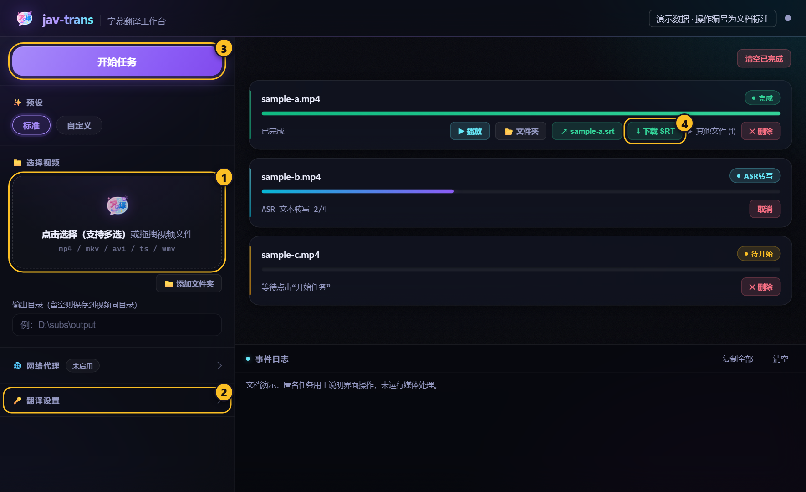

# jav-trans

jav-trans 是一个面向 Windows + NVIDIA 显卡的本地 JAV 字幕生成工具。它把视频处理成日文字幕、中文字幕或中日双语字幕，并把音频准备、语音岛检测、内部切分、Pre-ASR CueQC、Qwen ASR、字幕时间轴、LLM 翻译和质量报告串成一条本地优先的流水线。

项目目标：本地完成视频、音频、边界切分、ASR 和字幕时间轴重计算；LLM 只负责翻译、术语一致和口吻连贯，不负责脑补剧情或修正 ASR 误听。

致谢：[WhisperJAV](https://github.com/a63n/WhisperJAV) 为本项目早期路线提供了重要参考。

---

## 界面预览



任务提交、实时阶段进度、显存/耗时监控和质量报告都在本地网页控制台完成。更多截图放在 `docs/images/`。

---

## 项目背景

本项目的边界系统不是单一 VAD，而是先检测连续人声包络，再逐层完成事件隔离、语义路由和首尾裁边，最终生成适合字幕和 ASR 的 speech-core chunk。

当前设计把职责拆开：

- Voice-envelope Scorer v12 只检测连续的真正人声事件：对白、语言耳语、带声呻吟、带声哭笑、歌唱和远处人声属于 `vocal_candidate`。纯呼吸气流、无声喘气、亲吻、吞咽、唾液/口腔动作、咳嗽等非嗓音人体声，以及静音、环境/BGM、机械、衣物/床体/水声和纯肉体撞击声属于 `non_vocal_candidate`；弱呻吟、耳语与纯气流无法可靠区分时标为训练忽略的 `unsure`。它不判断语义，也不按句切分。
- Boundary Proposal 只提供高召回候选断点；Acoustic Split v4 学习 `cut/continue`，负责把包络内独立事件隔离成 provisional sub-islands。
- Pre-ASR CueQC v13 对 provisional sub-island 做 `keep/drop` 二分类 argmax 路由；teacher/data 层可以保留 `unsure`，但模型不会输出它。
- Inner Edge Refiner v2 对 CueQC 保留的 sub-island 做逐帧二分类 argmax，裁成送入 ASR 的 acoustic semantic core。
- Outer Edge Refiner 暂不作为默认组件；只在真实 v12 输出上比较 no-Outer 与 edge-only Outer，证明有独立收益后才保留。
- 字幕 layout 只处理显示规则，不反向修改 ASR chunk 语义。

这样做是为了避免一个模型同时承担“找语音、切句、删噪声、修边界、做字幕排版”。设计演进、实验记录、失败路线和更新记录都放在 [docs/HISTORY.md](docs/HISTORY.md)。

---

## 快速开始

本仓库和 GitHub Releases 仅维护源码、测试、必要 checkpoint、release notes 与版本说明。打包器、打包配置和二进制发布产物不进入远端仓库。

### 源码运行

推荐环境：

- Windows 10/11。
- NVIDIA 独立显卡和较新的驱动。
- Python 3.14+（与 `pyproject.toml` 的运行时约束一致）。
- FFmpeg Shared（TorchCodec 需要 FFmpeg 共享 DLL），并确保命令行能直接执行 `ffmpeg`。
- Git。

Windows 请安装 Shared 版。不要同时保留会优先占用 `PATH` 的 `Gyan.FFmpeg`
静态版：

```powershell
winget uninstall --id Gyan.FFmpeg --exact
winget install --id Gyan.FFmpeg.Shared --exact

# 关闭并重新打开终端后验证：应指向 full_build-shared\bin
where.exe ffmpeg
Get-ChildItem (Split-Path (Get-Command ffmpeg).Source) -Filter "avcodec-*.dll"
```

如果 `where.exe ffmpeg` 仍列出多个版本，请确保
`Gyan.FFmpeg.Shared\...\full_build-shared\bin` 排在 `PATH` 最前，随后重启
jav-trans。仅有 `ffmpeg.exe` 还不够；其目录必须同时存在
`avcodec-*.dll`、`avformat-*.dll` 和 `avutil-*.dll`。

项目安装：

```powershell
git clone https://github.com/jaykwok/jav-trans.git
cd jav-trans

uv venv
uv sync
```

Qwen3-ASR 原生支持要求 `transformers>=5.13.0`（由 `requirements.txt` 安装）。

启动网页控制台：

```powershell
$env:PYTHONIOENCODING="utf-8"
uv run --no-sync python launcher.py
```

默认地址为 `http://127.0.0.1:17321`。首次运行可以没有 `.env`；打开页面后在“翻译 API”面板填写 API Key、Base URL、模型和目标语言，保存或开始任务时会自动写入项目根目录 `.env`。新建的 `.env` 只启用实际保存的本机值，ASR batch、后端、显存预算等研究项会以注释示例形式写入。国内网络下载 Hugging Face 模型较慢时，可在“识别设置”里填写代理协议、地址和端口。

Web 提交是否使用 CUDA 取决于后端服务进程是否能看到 GPU，而不是浏览器本身。完整 SpeechBoundary-JA / ASR smoke 应确认日志中出现 `cuda_available=True`、`device=cuda:0` 或 `actual_device=cuda`。
Web 会在模型要求检查中提示驱动过旧或 CUDA 初始化失败。

---

## 使用流程

1. 打开网页控制台。
2. 选择视频文件。
3. 选择字幕模式、ASR 后端和翻译设置。
4. 选中的视频会立即进入右侧“待开始”列表；确认后点击“开始任务”。
5. 在输出目录查看 SRT、质量报告和日志。

任务正常完成后会保留可复用的 Boundary cache；从右侧任务列表删除已结束任务时，会同时清理该视频的全部 Boundary cache 变体、未完成的 ASR checkpoint 和任务临时目录。运行中的任务第一次删除只执行取消，进入“已取消”后再次删除才会清理缓存。

勾选“不翻译（仅日文字幕）”时，流水线仍会执行边界规划、可选 Pre-ASR CueQC、ASR 和 Boundary chunk 字幕时间轴生成，但跳过 LLM 翻译，最终输出 `<视频名>.ja.srt`。这是验证本地边界 / ASR / 字幕时间轴链路的推荐 smoke 模式。

---

## 完整工作流

```text
视频输入
  -> 任务上下文 / 配置解析
  -> 音频抽取与标准化
  -> Shared Qwen feature extraction
     - Qwen ASR repo 对应的 frozen PTM/encoder frame features
     - MFCC / timing numeric features
  -> Voice-envelope Scorer v12（1.7B，按 voice-only 标签完全随机初始化重训中，registry 仍为空）
     - 主臂：raw PTM2048 -> checkpoint 内 Linear(2048->2048)+GELU
     - 与 normalized MFCC40 拼接后 Linear(2088->256)
     - valid-prefix bidirectional Mamba2(hidden=256)
     - 四个冻结实验臂：frame argmax / linear-chain CRF / Frame–Event Query-Mask / Dense Span + exact DP
     - vocal_candidate / non_vocal_candidate 二分类；teacher/canonical unsure=-100 不参与训练
  -> Boundary Proposal（高召回候选断点，不直接决定最终 cut）
  -> 按 ASR repo 进入互不混用的边界链
     - 1.7B：Acoustic Split v4 binary argmax
       -> provisional sub-islands
       -> Pre-ASR CueQC v13 binary argmax
       -> Inner Edge Refiner v2 binary acoustic core
       -> chunk packing / boundary-cache
       -> 可选 edge-only Outer 仅在真实 A/B 证明有收益后加入
     - 0.6B：空 registry placeholder 保持不动，暂不训练或修改
     - drop 的 chunk 不导出 wav、不进入 ASR
  -> ASR wav chunk export
  -> Qwen ASR text transcription
  -> Boundary chunk subtitle timing
     - ASR 文本负责字幕文本
     - acoustic timeline 来自 source absolute boundary
  -> Subtitle Layout v2
     - acoustic/display 双时间轴
     - 20-frame 最小显示时间（固定 `24000/1001` 基准）
     - 2-frame 最小间隔（固定 `24000/1001` 基准）
     - 7s 最大显示 soft guard
     - 长 cue 先按 ASR 文本断句，再吸附 weak cut，没有 weak cut 才比例估算
  -> 可选 LLM 翻译
  -> SRT / bilingual JSON / quality report / logs
```

关键约束：

- Scorer v12 只决定是否存在连续真正人声事件，不负责语义 drop 或句内切点；Proposal 只能附加非绑定候选，最终 cut 由 Split 决定。
- 内部 cut 是一个共享绝对时间戳，不允许左右 chunk 各自修边。
- `20 / (24000/1001)` 是字幕最短显示和 micro chunk 风险线，不是 runtime duration-only drop 阈值。
- 7 秒是字幕显示 soft guard，不是 ASR chunk 上限。
- Runtime 不使用具体词黑名单或时长启发式删除短促人声；是否进入 ASR 由 Pre-ASR CueQC 模型标签决定。
- Scorer v12 的各 decoder、Split v4、CueQC v13 与 Inner v2 都不读取 runtime threshold，不使用 hysteresis、固定时长、NMS、规则 merge 或 fallback。旧 Scorer 只保留为离线失败证据，v10/v11 checkpoint 和 canonical 不能 warm-start 或转换成 v12。
- Boundary 阶段按 Scorer → Proposal → Split → CueQC → Inner 串行加载和释放模型；Inner 只对 CueQC argmax keep 的 provisional sub-islands 推理，且只能裁首尾、不能挖内部空洞。Boundary cache 把 provisional chunk JSON 与同一内容签名的 raw PTM/MFCC sidecar 分开保存，缓存命中无需重复提取特征。allocated/reserved/shared VRAM 只写运行诊断，不参与功能判断；显式 CUDA 请求不可用时直接报错，不回退 CPU，任何超过 telemetry noise floor 的 shared VRAM spill 都是 soft OOM。
- 1.7B production registry 在 v12 数值与人工 gate 完成前保持为空；Outer 不阻塞当前 Scorer v12 训练，也不默认进入生产链。
- 0.6B Boundary registry 当前为空；选择该档会在模型加载前明确报告 `pending_binary_retrain`。

---

## 模型架构

当前只开发和审计 1.7B Boundary 链；0.6B 仅保留空 registry placeholder：

- `jaykwok/Qwen3-ASR-1.7B-JA-Anime-Galgame-hf`：默认高质量档。
- `jaykwok/Qwen3-ASR-0.6B-JA-Anime-Galgame-hf`：仅保留 ASR repo 与空 Boundary registry placeholder；全链重训留作未来 backlog，本轮不训练、不修改。

Scorer v12 主容量合同为逐帧 raw PTM2048→trainable Linear(2048→2048)+GELU，与 normalized MFCC40 拼接后再经 Linear(2088→256) 输入双向 Mamba2(hidden=256)。PTM2048 只是冻结特征提取结果；所有 v12 adapter、时序主干和 decoder 都从 seed=`117` 完全随机初始化。当前固定比较 frame argmax、linear-chain CRF、Frame–Event Query-Mask 与 Dense Span + exact DP 四个结构化 decoder；训练与 runtime 不加入阈值或规则平滑，test 只在 val 选出前两名后运行。

所有小模型统一放在：

```text
src/checkpoints/
├── jaykwok-Qwen3-ASR-0.6B-JA-Anime-Galgame-hf/
└── jaykwok-Qwen3-ASR-1.7B-JA-Anime-Galgame-hf/
```

1.7B 的目标 Boundary pipeline 统一使用合同 `boundary_acoustic_binary_v12`：Scorer v12 → Proposal → Acoustic Split v4 → provisional sub-islands → CueQC v13 → Inner v2 acoustic core → Chunk/ASR。Outer 只保留 no-Outer / edge-only A/B，不再预设为必需组件。模型缺失、repo 不匹配、合同不兼容或选择 0.6B 都会直接报错，不提供规则 fallback 或静默迁移。

当前训练数据状态：Gemini 3.6 Flash Medium 以一次完整 source 三态调用输出 `vocal_candidate / non_vocal_candidate / unsure` 连续全覆盖；请求固定 `max_tokens=8192 / MM:SS.mmm`，不发送 temperature/top-p/top-k。25 条 pilot 已由用户整页批准，canonical 为 train/val/test=`13/5/7`、vocal/non-vocal=`85418/8227` 帧。完整真实 source manifest 已冻结为 train/val/test=`120/10/14`、29 个有效 video；旧 v11 语义标签和旧人工“去呻吟”审计均不进入 v12。完整 train 可在绑定 pilot 校准 SHA、相同 provider/model/prompt/执行合同时使用 Teacher 证据；val/test 仍需人工 verdict。四个 decoder 的 2-step CUDA smoke 已通过，只证明路径可训练，不用于选优；正式 full training 尚未完成。详细合同与选优顺序见 [Scorer v12 structured-decoder training plan](docs/audits/20260725_scorer-v12-structured-decoder-training-plan.md)，旧 v11 实验只作为失败路线保存在 [docs/HISTORY.md](docs/HISTORY.md)。

Split v4 当前唯一合法训练数据合同是
`acoustic_split_v4_sequence_dataset_summary_v1`：raw PTM2048 + MFCC40（frame
width 2088）、当前 candidate scalar schema、固定 `train/val/test` source
partition，并绑定 Scorer/Proposal/Outer 三个 checkpoint SHA、音频/特征/dataset
sidecar SHA 和 `boundary_acoustic_binary_v12`。`compile_joint_boundary_preasr_dataset.py`
与 `merge_semantic_split_datasets.py` 会拒绝旧 row-wise、rehydrate、audit-only
或缺 summary 的输入；trainer 还会拒绝 CUDA 不可用、非有限值和空监督 batch。
当前 Runtime 尚未真正实现 `SEMANTIC_SPLIT_FEATURE_EXPORT_PATH` 的 candidate
feature/metadata 导出，因此准备器会明确 fail-closed；任何 pending 产物都不能
被标成 training-ready。完整代码审计见
[20260723 full-code-audit-v2](docs/audits/20260723_full-code-audit-v2.md)。

---

## 默认配置

默认配置内置在 `src/core/config.py`，首次保存 Web 设置时会自动生成 `.env`。`.env` 只用于本机私密值和显式覆盖，不复制默认配置。通常只需要在 Web “翻译 API”面板填写：

- `API_KEY`
- `OPENAI_COMPATIBILITY_BASE_URL`
- `LLM_MODEL_NAME`

离线音频多模态 Teacher 使用三个隔离配置：`~/.config/omni/qwen`、
`~/.config/omni/openrouter` 与 `~/.config/omni/gemini`。CLI 只接受
`--env-file qwen|openrouter|gemini` 这些已知 profile，不接受任意文件名静默
猜测协议。Qwen/OpenRouter 使用各自的兼容 API adapter；`gemini` 专指 Google
AI Studio 原生 Interactions API，不再作为 OpenRouter Gemini 的别名。
OpenRouter 常用键为 `OMNI_MODEL/OMNI_API_KEY/OMNI_BASE_URL`；原生 Gemini
使用 `GEMINI_MODEL=gemini-3.6-flash`（可省略）与
`GEMINI_API_KEY=KEY_1,KEY_2`。逗号分隔 Key 去重后按槽位管理，同一 Key 的
请求起点按每槽位 5 RPM 限速，并保守按每槽位 20 RPD 管理；RPD 在太平洋时间
午夜重置；每个真正发出的请求（包括返回错误的请求）都会在发送前计入 RPD。
状态原子保存在同目录 `gemini.quota.json`，其中只有 Key 的 SHA-256 指纹，不含
Key 值；每个指纹记录最近 60 秒请求时间与 token usage、RPM/TPM/RPD 剩余额度、
当日首次/最近请求时间、下一次可请求时间、429 冷却截止时间和下一次 RPD 重置
时间。进程重启后继续读取这些状态；新增、删除或重排 Key 依靠指纹稳定匹配。
达到本地日预算会主动切到下一槽位，远端 HTTP 429 也会切换槽位。原生 Gemini
批处理默认 `--workers=0`，即一 Key 一 worker，并行请求仍由各自状态独立限速；
可用 `--workers N` 主动降低并发，但不能超过 Key 数量。Google 官方实际按
project 而不是 Key 计费/限流，因此多个 Key 只有在属于不同 project 时才会提供
多份独立额度。
OpenRouter 上的 Gemini 数据标注请求默认使用 `reasoning.effort=medium`、默认
`max_tokens=8192` 和 `input_audio_raw`，默认不设置 `reasoning.exclude`
（需要隐藏思考文本时用 `--exclude-reasoning`）；`high` 只用于显式受控
A/B，不作为 canonical 数据标注默认值。Qwen 使用
`enable_thinking/thinking_budget`、默认 `max_tokens=2048` 和
`input_audio`。Qwen 与 OpenRouter 均不显式发送 temperature、top-p 或
top-k。原生 Gemini 使用 `POST /v1beta/interactions`、内联音频、
`thinking_level=medium`、`max_output_tokens=8192`、结构化 JSON 输出且
`store=false`，同样不发送 temperature、top-p 或 top-k。任何要求 Teacher 生成时间坐标的工具统一使用
`omni_audio_timestamp_mmss_mmm_v1`：wire 字段为严格字符串
`start_ts/end_ts/time_ts`（`MM:SS.mmm`），旧数字秒响应直接拒绝；本地严格
解析后，训练与审计 manifest 内部仍可保存数值 `start_s/end_s/time_s`。
- 代理协议 / 地址 / 端口（可选，用于模型下载和 HTTP 请求）

ASR 显存自适应默认值已经内置。当前完整工作流固定使用 `1.7B`；batch 或显存预算可通过“参数调优”里的环境变量覆盖，或手动编辑首次保存后生成的 `.env`。

默认配置：

```env
ASR_BACKEND=jaykwok/Qwen3-ASR-1.7B-JA-Anime-Galgame-hf
ASR_BATCH_SIZE=auto
ASR_BATCH_SIZE_BY_REPO=jaykwok/Qwen3-ASR-0.6B-JA-Anime-Galgame-hf=12,jaykwok/Qwen3-ASR-1.7B-JA-Anime-Galgame-hf=4
ASR_STAGE_WORKER_VRAM_BUDGET_MB=auto
ASR_STAGE_WORKER_VRAM_RATIO=0.95
ASR_MIN_PHYSICAL_VRAM_MB_BY_REPO=jaykwok/Qwen3-ASR-0.6B-JA-Anime-Galgame-hf=4096,jaykwok/Qwen3-ASR-1.7B-JA-Anime-Galgame-hf=6144
ASR_STAGE_WORKER_RAM_RATIO=0.95
ASR_STAGE_WORKER_HEARTBEAT_S=10
ASR_STAGE_WORKER_OOM_RETRY_LIMIT=6
GPU_BATCH_PROFILE_ENABLED=1
GPU_BATCH_PROFILE_GROWTH_THRESHOLD=0.80
SPEECH_BOUNDARY_JA_WINDOW_S=20
SPEECH_BOUNDARY_JA_OVERLAP_S=4
ACOUSTIC_SPLIT_MAX_BATCH_CANDIDATES=auto
PRE_ASR_CUEQC_ENABLED=1
```

ASR stage 固定由统一 GPU worker 持有 CUDA：Boundary/PTM feature extraction、Pre-ASR CueQC、ASR 和对齐都在同一个 GPU owner 进程里顺序执行，Web / 调度主进程只做任务编排、缓存索引和输出写入。OOM、CUDA 状态异常或超过 `ASR_STAGE_WORKER_VRAM_BUDGET_MB` 时会杀掉 worker，不会把 Web 主进程一起带崩。

`ASR_STAGE_WORKER_VRAM_BUDGET_MB=auto` 按物理 dedicated VRAM × `0.95` 计算软 OOM 线；RTX 4060 Ti `8188MiB` 的 cap 约为 `7779MiB`。当前 1.7B 完整推理链要求至少 `6144MiB` 物理 dedicated VRAM，并在模型加载前检查；shared VRAM 不计入可用预算，任何正的基线增量都立即视为 soft OOM，显式放大的 worker budget 和 CPU fallback 都不能绕过。监控不可用会直接停止。物理 RAM 使用按 `total-available` 计算，超过 `total × ASR_STAGE_WORKER_RAM_RATIO`（默认 `0.95`）同样停止。

GPU worker 默认每 10 秒输出一次当前阶段、总耗时和静默时长心跳。字幕 cue plan 会单独记录 timeline normalize、两轮 anchor-aware DP、polish 和 finalize 进度。

Boundary cache 只使用序列化合同 ID `boundary_acoustic_binary_v12` 判断结构兼容性；整数 pipeline/cache version 已删除。cache 签名仍包含 repo-bound 模型内容摘要和运行配置，合同 ID 或模型内容不一致都会直接 miss。

`ASR_BATCH_SIZE=auto` 以 5600MB 下的 repo 默认表为基线，按显存预算比例放缩初始 batch。ASR text batch 与 Acoustic Split candidate batch 发生 GPU OOM 时会重启 worker、降低对应 batch 并从 cache/checkpoint 续跑；CueQC v13 按完整 planned-island group 与 padded-chunk 预算分批，不拆单个 group。RAM OOM 直接停止，不伪装成可由 GPU batch 修复的问题。

auto batch 会在 `tmp/cache/gpu_batch_profiles.json` 按 GPU、模型和推理配置跨任务学习。v2 profile 记录已验证安全 batch 与 OOM 不安全上界：阶段 peak allocated 低于预算 `80%` 时，在两者之间二分探测；尚无 OOM 上界时则向当前阶段上限折半推进，OOM 后本次任务仍先减半恢复。当前覆盖 ASR chunk batch 与 Semantic Split 独立候选 batch。CueQC v13 另按 whole planned-island group 和 padded-chunk 预算分批，单个 group 的完整序列不拆分；显式数字 batch 不参与 profile 学习，Speech scorer/PTM 的 20 秒时序窗口也不改变模型可见上下文。

推理需要 ASR / SpeechBoundary-JA frozen feature Hugging Face 模型，以及与当前 repo id 匹配的本地 checkpoint。源码运行时如果本地没有 Hugging Face 模型，会按需下载到 `models/`。registry 缺失、覆盖映射未命中当前 repo id、文件不存在、schema 不匹配或 metadata 不匹配都会 fail-fast。

训练时生成的 CUDA feature cache、synthetic WAV、sequence JSONL、tensor cache 和 `datasets/train/...` 产物都不是运行依赖，不随源码或 Windows release 打包。

---

## 字幕与文本策略

- ASR 文本会做 Unicode NFKC、空白归一、换行折叠和展示安全处理。
- Qwen3-ASR runtime 始终使用 Transformers 官方 `apply_transcription_request(audio=..., language=...)` 路径，不提供演员名 / 人名 context 提示分支。
- 字幕时间轴来自 Boundary chunk；ASR 输出文本只负责显示，不驱动默认切分。
- LLM 翻译前会先固定 cue plan，翻译不会重排时间轴。

---

## 输出与缓存

- `video/<视频名>/`：正式字幕、质量报告和人工质检报告。
- `models/`：Hugging Face 模型缓存。
- `tmp/jobs/<job_id>/`：Web / pipeline 单次任务临时目录；`JOB_TEMP_DIR` 默认是 `./tmp/jobs`。
- `tmp/chunks/`：ASR wav chunk 和 crash-resume checkpoint 的一次性运行目录。
- `tmp/cache/boundary/`：SpeechBoundary-JA frame score 到 Boundary Refiner 输出的 boundary-cache。
- `tmp/cache/torch/`、`tmp/cache/hf/`：torch / Hugging Face 运行缓存。
- `tmp/log/<job_id>/`：默认启用的本地诊断目录；包含 `.run.log` 和持久化 `.timings.json`。
- `datasets/`：本地训练、验证、测试数据归档，默认 ignored；不进入 GitHub 源码仓库。
- `agents/temp/`：研究脚本、smoke、临时日志和中间产物。
- `agents/audits/`：可长期复查的本地审计页，默认 ignored，不随 `git push` 发布。

本地审计页服务：

```powershell
.\tools\audits\serve_audits.ps1
```

审计导航会显示每个审计产物的生成时间，优先使用 summary 时间，其次使用目录名前缀，便于区分多轮审计页。审计服务支持音频 Range seek 和导航页删除 API。直接打开 HTML 可以浏览页面，但删除按钮不能真正移动本地审计目录。

成功运行后默认删除一次性 job 临时目录；保留可复用缓存，例如 `models/`、`tmp/cache/boundary/` 和 Web 状态。

---

## 常见问题

### 模型下载慢

在 Web “识别设置”里填写代理，例如：

```env
PROXY_PROTOCOL=http
PROXY_HOST=127.0.0.1
PROXY_PORT=7890
```

或提前把模型下载到 `models/` 对应目录。

### CUDA 没有被使用

确认日志中出现：

```text
actual_device=cuda
model_param_device=cuda:*
```

受限 sandbox、错误的 PyTorch wheel、驱动问题或从非 GPU 环境启动 Web 服务都会使 CUDA 启动检查失败；正式工作流不会转到 CPU 继续执行。

### 显存不足

默认配置已按 6GB 级显存目标设置（见上文「默认配置」）。如果仍然 OOM，先降低当前模型 batch：

```env
ASR_BATCH_SIZE=2
```

0.6B Boundary registry 当前保持空 placeholder，不能用于完整工作流；全链重训留作未来 backlog。

### 长任务怎么排查

运行日志默认写入 `tmp/log/<job_id>/`。`.run.log` 便于查错，`.timings.json` 记录音频准备、Boundary/Pre-ASR/ASR、翻译、写出等阶段耗时和显存快照；Web 完成任务后也会把这两个文件列在“其他文件”里。反馈问题时请保留 `.run.log`、`.timings.json`、质量报告和对应 SRT。

---

## 开发

主要代码位置：

- `src/main.py`：主流程编排。
- `src/core/`：配置和任务上下文。
- `src/pipeline/`：音频、缓存、输出、质量报告和阶段日志。
- `src/asr/`：ASR、Boundary 字幕时间轴分配、Pre-ASR CueQC 和转写流程。
- `src/boundary/`：Boundary Refiner checkpoint loader、edge-sequence Mamba2 adapter、core planner 和 boundary-cache。
- `src/boundary/ja/`：SpeechBoundary-JA scorer、PTM/MFCC feature cache schema、训练数据 manifest 和 frame-score 训练工具。
- `src/llm/`：翻译 prompt、cache、glossary、API patch 和 translator。
- `src/subtitles/`：SRT writer、字幕选项和字幕 QC。
- `src/web/`：FastAPI 接口和静态前端。
- `tools/`：训练、字幕审计和 workflow smoke 工具。

常用测试：

```powershell
$env:PYTHONIOENCODING='utf-8'
uv run pytest tests/test_config.py tests/web/test_jobs_api.py tests/test_asr_backend_dispatch.py
uv run pytest tests/test_boundary_cache.py tests/test_semantic_boundary_runtime.py tests/test_chunk_packer.py tests/test_pipeline_chunk_config_runtime.py
uv run pytest tests/test_translation_cache.py tests/test_translator_prompt.py tests/test_quality_report_output.py
```

---

## 工具索引

所有 Python 工具都从项目根目录执行，并使用当前 `.venv`：

```powershell
$env:PYTHONIOENCODING='utf-8'
uv run python -m <module> --help
```

常用入口：

- `tools.workflows.run_full_workflow`：命令行完整工作流 smoke。
- `tools.web.smoke.start_server` / `submit_job` / `poll_job` / `summarize_job`：Web 服务 smoke 和任务汇总。
- `tools.audits.audit_nav` / `serve_audits.ps1`：审计页导航与 Windows 本地服务。
- `tools.audits.review_page_core` / `audit_prompt`：人工审计页共享 Core（`MM:SS.mmm` 区间显示与播放器、状态、完成度、保存 API）与可复用提示配置；任务特有布局、证据和完备 verdict 组合由 Adapter 提供。设计合同见 [Human Audit Page Core](docs/audits/20260723_human-audit-page-core-v1.md)。
- `tools.omni.timestamp_contract`：所有区间 Teacher 的严格 `MM:SS.mmm` wire schema、格式化、解析和 source-bound 校验；不提供数字秒兼容或时间猜测。
- `tools.omni.run_audio_teacher` / `tools.omni.audio_teacher_batch`：音频 Teacher Core；统一处理 `--prompt/--prompt-file`、`--folder/--file/--manifest`、provider-safe 并发、进度、续跑和主线程串行化落盘，不直接生成训练真值。
- `tools.omni.audio_teacher_transport`：Qwen、OpenRouter、Google AI Studio 三个 provider Adapter 的唯一分派入口；请求与响应协议互不冒充。
- `tools.omni.gemini_native` / `tools.omni.inspect_gemini_quota`：Google AI Studio 原生 Interactions 音频 Adapter 与无请求状态入口；实现内联音频、结构化输出、思考/usage 证据、每槽位 5 RPM / 250k TPM / 20 RPD、太平洋日界线、可读配额状态账本与多 Key 429 轮换。`uv run python -m tools.omni.inspect_gemini_quota` 不发送 API 请求，只刷新并显示脱敏状态。
- `tools.boundary.ja.build_vocal_envelope_scorer_v12_pilot_manifest` / `build_vocal_envelope_scorer_v12_full_manifest`：从冻结 source/partition 只重用身份并重新校验音频 SHA、时长、采样和 frame geometry；不继承 v11 标签、span 或 ASR 文本。
- `tools.boundary.ja.label_vocal_envelope_scorer_v12_with_omni` / `vocal_envelope_scorer_v12_calibration` / `compile_vocal_envelope_scorer_v12_canonical`：Scorer v12 单调用三态 Teacher、固定 25 条人工批准校准合同与严格 canonical compiler；可把完全相同音频/帧/区间的 pilot 证据零请求重绑定到 full manifest，train 允许校准 Teacher 监督，非 pilot val/test 仍必须人工审计。
- `tools.boundary.ja.train_vocal_envelope_scorer_v12`：完全随机初始化的 v12 训练器，支持 argmax structured、CRF、Query-Mask 与 Dense Span decoder，持续写入原子 `progress.json`。
- `tools.audits.generate_candidate_island_dual_evidence_review`：Scorer Protect×Remove 与人工 full-source truth 的三轴 bridge-gap Adapter。
- `tools.audits.generate_vocal_envelope_scorer_v12_teacher_audit_html`：Scorer v12 三态 Teacher 审计 Adapter；可筛选 train/val/test，并仅在 full evidence 与固定人工批准 pilot 的音频、帧和区间完全一致时跳过已审 calibration source，保存结果始终绑定当前 full manifest/preaudit SHA。
- `tools.audits.record_vocal_envelope_scorer_v12_approval`：仅在用户明确完成整页审听并统一批准时，把 Scorer v12 审计页的三轴全通过裁决按 source/preaudit SHA 原子写成 `manual_verdicts.jsonl`；不会自动判断或绕过人工 gate。
- `tools.audits.generate_candidate_island_dual_evidence_ab_review`：在两个已规范化 Scorer dual-evidence review 上复用同一 Core 的 High/Medium A/B Adapter；比较人工真语音保留、outside precision、监督覆盖与逐帧差异。
- `tools.boundary.ja.select_candidate_island_scorer_v11_mixed_source_manifest` / `compile_candidate_island_scorer_v11_mixed_dual_evidence`：固定一 source/一 video 的真实 mixed-source Teacher manifest，并把独立 Protect/Remove 证据严格编译为 inside/outside/unsure canonical；不使用补集或标签继承。
- `tools.boundary.ja.audit_candidate_island_scorer_v11_supervision_distribution`：Scorer v11 canonical 的逐 source 标签拓扑与真实 train↔held-out mixed 监督分布审计；只输出诊断证据，不生成训练标签。
- `tools.audits.score_candidate_island_scorer_v11_checkpoint` / `generate_candidate_island_scorer_v11_prediction_audit_html`：按完整 source 聚合 Scorer checkpoint，单列 teacher all-outside source、outside event、continuity 与精确 residual，并生成可播放/可保存裁决的 prediction Adapter。
- `tools.audits.generate_pre_asr_v13_false_drop_audit_html`：CueQC v13 false-drop Adapter。
- `tools.audits.generate_split_v4_missing_cut_candidate_audit_html` / `generate_acoustic_split_canonical_candidate_audit_html`：Split v4 missing-cut 与 canonical candidate Adapter。现役/退役清单见 [人工审计 Adapter inventory](docs/audits/20260723_human-audit-adapter-inventory-v1.md)。
- `tools.datasets.label_joint_boundary_preasr_with_omni`：实时 Omni 小规模标注。
- `tools.datasets.batch_joint_boundary_preasr_with_omni`：Omni Batch 全量标注。
- `tools.workflows.promote_torch_checkpoint`：晋升生产 checkpoint。

其余训练、数据集和审计工具直接通过 `uv run python -m <module> --help` 查看；实验流程与指标放在 [docs/HISTORY.md](docs/HISTORY.md)。

命令行完整工作流 smoke：

```powershell
uv run python -m tools.workflows.run_full_workflow --video video/<your-video>.mp4 --task-name 20260617_191654_cli-smoke --label smoke
```

训练、诊断、实验记录和动态计划不在 README 展开；见 [docs/HISTORY.md](docs/HISTORY.md)。

---

## 更新记录

更新记录、实验路线、踩坑笔记和后续计划见 [docs/HISTORY.md](docs/HISTORY.md)。
