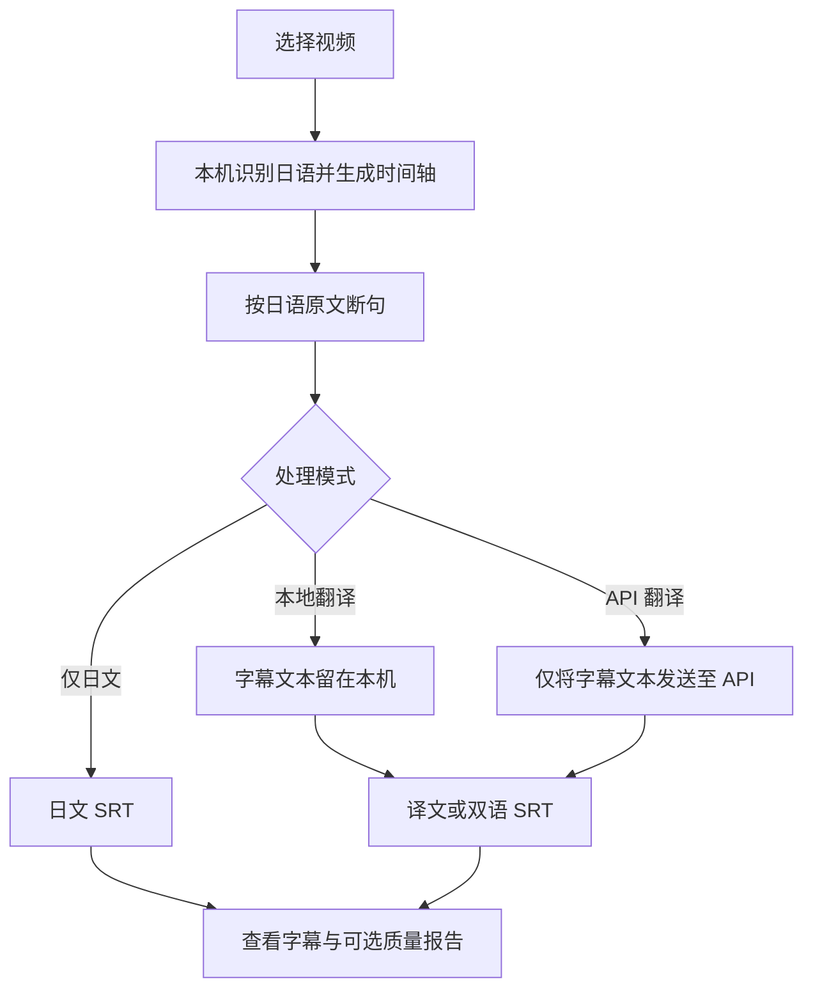
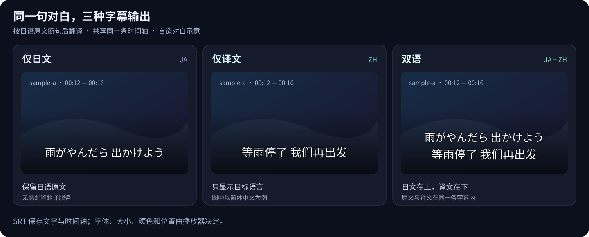
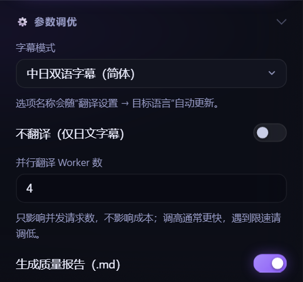
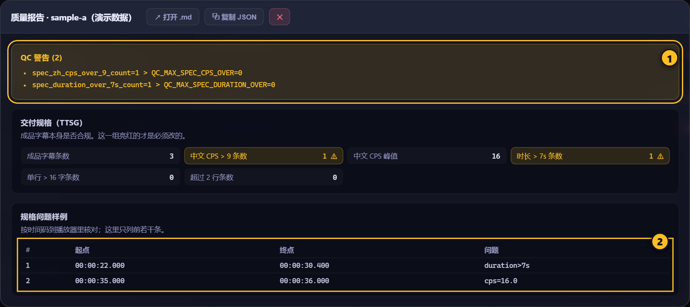

# jav-trans

**把 JAV 日语视频变成日文、译文或双语字幕。** 在本地控制台选择视频，即可完成语音识别、时间轴、可选翻译和字幕导出。

[**下载 Windows 发布包**](https://github.com/jaykwok/jav-trans/releases/latest/download/jav-trans-windows-x64.zip) · [版本说明](https://github.com/jaykwok/jav-trans/releases/latest) · [快速开始](#快速开始) · [模式选择](#选择处理模式) · [常见问题](#常见问题)

适用于 **Windows 10/11 + NVIDIA 显卡**。视频与音频始终在本机处理；仅日文和本地翻译模式不上传字幕，API 模式会将字幕文本及你提供的翻译参考发送到所选服务。

**默认保存位置：输出目录留空时，字幕保存到视频文件所在文件夹。** 也可以在控制台指定其他输出目录。


*主图展示“标准”预设。编号为文档标注，匿名任务状态与数值均为演示数据；点击图片可查看大图。*

## 运行要求

| 项目 | 要求 |
| --- | --- |
| 系统 | Windows 10/11 |
| 显卡 | NVIDIA 独立显卡，至少 **6GB 物理显存**，推荐 8 GB 及以上 |
| 磁盘 | 解压到普通可写目录，预留至少 **15 GB**，处理视频还需要额外输出空间 |
| 网络 | 首次准备环境和下载模型时需要联网；API 翻译需要持续联网 |

正式 ASR 要求 CUDA。CUDA 不可用、驱动过旧或显存不足时会明确报错。

<details>
<summary><strong>发布包包含什么？哪些会自动下载？</strong></summary>

发布包约 100 MB，包含入口、启动器、程序代码、依赖清单和 FFmpeg Shared。运行环境与模型按需下载。

| 内容 | 如何准备 |
| --- | --- |
| FFmpeg | 发布包已包含，无需单独安装 |
| uv | 启动器先检测已有版本，缺失时自动从 PyPI 下载 |
| Python、PyTorch 等依赖 | 启动器自动准备，不必手工逐个安装 |
| ASR 模型与 CTC v3 对齐头 | 首次转录时下载；ASR 模型约 3.9 GB |
| 本地翻译模型 | 首次本地翻译时下载 Hy-MT2-7B Q4，约 4.6 GB |
| llama.cpp | 使用本地翻译时需要额外安装或配置，见[本地翻译](#本地翻译) |
| API Key | 使用 API 翻译时自行填写 |

依赖安装中断后，重新双击 `jav-trans.exe` 可继续准备。模型下载完成后会保留在本机。

</details>

## 快速开始

1. **下载并启动。** 下载上方的 `jav-trans-windows-x64.zip`，解压后双击 `jav-trans.exe`。按提示准备网络和运行环境，等待控制台打开。
2. **添加一个短视频。** 点击图中 **① 选择视频**，也可拖入文件或添加文件夹；按需指定输出目录。
3. **配置翻译。** 保持“标准”预设，展开 **② 翻译设置**，选择 API 或本地后端，按下方步骤配置并保存。默认目标语言为简体中文。
4. **开始并查看结果。** 点击 **③ 开始任务**。首次转录会下载识别模型和对齐头；任务显示“完成”后，在 **④ 结果区域**打开文件夹或下载 SRT。

标准预设使用默认任务参数，生成**仅译文字幕**。需要仅日文、双语或质量报告时，再使用下方的[自定义选项](#自定义选项)。

## 选择处理模式

| 模式 | 额外准备 | 是否向翻译服务发送文本 | 适合场景 |
| --- | --- | --- | --- |
| **API 翻译** | 支持 Responses 接口的服务与 API Key | 是 | 标准预设的默认后端，支持全片参考、角色参考和可选语义复核 |
| **本地翻译** | llama.cpp；首次下载翻译模型 | 否 | 字幕留在本机，无 API 调用费用 |
| **仅日文** | 在[自定义选项](#自定义选项)中开启 | 否 | 只需要日文 SRT，或暂不配置翻译服务 |

标准预设可以使用 API 或本地翻译。后端与目标语言都在“翻译设置”中配置，保存后即可开始任务。

### 本地翻译

<details>
<summary>展开安装与配置步骤</summary>

1. 在 PowerShell 安装 llama.cpp：

   ```powershell
   winget install -e --id ggml.llamacpp
   ```

2. 在“翻译设置 → 翻译后端”选择“本地翻译（Hy-MT2-7B Q4 · llama.cpp）”。
3. 已安装的 `llama-server` 可自动查找；手动解压的版本需要填写所在文件夹或 exe 路径。
4. 选择目标语言，保存翻译设置后开始任务。固定使用的 `Hy-MT2-7B-Q4_K_M.gguf` 会在首次翻译时自动下载。

需要手动安装 NVIDIA CUDA 版时，见[本地翻译配置](docs/ADVANCED.md#本地翻译)。本地模型结合邻近原文翻译，仍可能误判省略的人物或动作，建议复查。

</details>

### API 翻译

<details>
<summary>展开配置步骤与接口要求</summary>

1. 在“翻译设置”选择“API 调用（OpenAI 兼容）”。
2. 填写 API Key，默认服务为 OpenRouter。改用其他服务时，同时填写对应的 Base URL 并保存。
3. 点击模型旁的“获取”，选择该服务提供的模型；确认目标语言和推理强度后再次保存。

服务必须支持 **Responses 接口（`/responses`）**，只支持 Chat Completions 的接口无法使用。Base URL 与模型名必须配套；具体示例和结构化输出设置见 [API 配置与排错](docs/ADVANCED.md#api-翻译)。

API 语义复核默认关闭，开启后会增加请求和等待时间，见[语义复核](docs/ADVANCED.md#语义复核)。

</details>

## 处理流程


```mermaid
flowchart TD
    A["选择视频"] --> B["本机识别日语并生成时间轴"]
    B --> C["按日语原文断句"]
    C --> D{"处理模式"}
    D -->|仅日文| E["日文 SRT"]
    D -->|本地翻译| F["字幕文本留在本机"]
    D -->|API 翻译| G["仅将字幕文本发送至 API"]
    F --> H["译文或双语 SRT"]
    G --> H
    E --> I["查看字幕与可选质量报告"]
    H --> I
```

- **先断日文，再翻译。** 完整句优先；确实过长时，只在完整分句和实测停顿处拆分。译文沿用原单元时间轴，中文换行不会再拆出新字幕条目。
- **保留对白，过滤非语义人声。** 过滤规则结合文本与声学信息，删除纯喘息、呻吟等非语义发声；含可辨识词语的内容保留。
- **复用已有工作。** 失败后可复用仍有效的识别和翻译缓存；保存或导出失败时，可单独重试交付结果。

## 字幕效果



*排版示意使用自造对白。SRT 保存文字与时间轴，实际字体、大小、颜色和位置由播放器决定；三个画面表示三种可选输出。*

中日两轨分别按对应的 Netflix 字幕规范排版，每轨最多两行；日文句号、顿号与中文逗号、句号会按规则转为空格。保留完整含义优先于凑字数，没有可靠断句点的长句会保留并标出布局风险。

标准预设对应图中的“仅译文”。双语字幕中日文在上、译文在下；播放器未自动加载时，手动打开对应的 SRT 文件。

## 自定义选项

需要调整输出类型或生成报告时，点击“**自定义**”，再展开“**参数调优**”。



*自定义界面节选，图中以双语字幕并开启质量报告为例。标准预设无需调整这些参数。*

| 想要的结果 | 如何设置 |
| --- | --- |
| 仅日文字幕 | 开启“不翻译（仅日文字幕）”，无需配置翻译服务 |
| 双语字幕 | 关闭“不翻译”，在“字幕模式”选择双语选项；名称随目标语言变化 |
| 质量报告 | 开启“生成质量报告（.md）”，在开始任务前设置 |

改好后可点击“保存自定义任务模板”记住这些选项。翻译服务仍在“翻译设置”中配置；切回“标准”会恢复默认任务参数。

## 质量报告

开始任务前，在“**自定义 → 参数调优**”开启“**生成质量报告（.md）**”。完成后，点击任务卡的“**质检**”。



*当前质量报告界面使用自造演示数据。① 查看触发的警告，② 找到问题字幕的时间码，再到播放器中复查。*

报告提示时间轴、阅读速度、布局和译文等风险，供人工判断。它不会保证每条字幕都正确；开启报告也不会自动开启付费的 API 语义复核。

## 输出与隐私

- **字幕在哪里？** SRT 导出到所选输出目录；仅日文模式生成 `sample-a.ja.srt`。任务卡也能打开或下载结果。
- **删任务会删字幕吗？** 删除任务卡保留已提交的 `tmp/outputs/` 结果和已导出的 SRT。`tmp/outputs/` 是正式结果目录，不能当普通缓存清理。
- **哪些内容会联网？** 模型与依赖需要下载；API 翻译会发送字幕文本及填写的翻译参考，具体数据处理规则取决于所选服务。视频和音频不上传。
- **可以接着上次做吗？** 有效缓存会保留；任务中途切换翻译后端或本地 server 路径会使受影响的任务停止，保存新设置后重新运行即可。

目录用途、结果清理和保存失败后的处理见[结果与恢复](docs/ADVANCED.md#结果与恢复)。

## 常见问题

| 遇到的情况 | 先做什么 |
| --- | --- |
| 程序窗口无法打开 | 在程序目录运行 `.\jav-trans.exe --doctor` 自检，见[启动与下载](docs/ADVANCED.md#启动与下载) |
| 下载慢或无法连接 | 在“网络代理”填写代理，或启动时使用 `--proxy`，见[启动与下载](docs/ADVANCED.md#启动与下载) |
| CUDA 或显存报错 | 关闭其他占用显卡的程序，检查驱动与显存，见[显卡与取消](docs/ADVANCED.md#显卡与取消) |
| API 报错、模型不可用 | 核对 Key、Base URL、模型与 Responses 支持，见 [API 翻译](docs/ADVANCED.md#api-翻译) |
| 卡在“停止中”或提示 GPU 未释放 | 查看提示条并等待清理，必要时点“重新检查”或“重试清理”，见[显卡与取消](docs/ADVANCED.md#显卡与取消) |
| 保存、产物提交或导出失败 | 使用任务卡对应的重试按钮，无需重新识别和翻译，见[结果与恢复](docs/ADVANCED.md#结果与恢复) |

### 设置写错了会怎样

通用数字和开关设置留空或无法解析时使用默认值，并对解析错误警告字段名；越界数字按设置类型限制到边界或恢复默认值。具有明确允许值的设置会直接报错。完整规则与示例见[配置校验](docs/ADVANCED.md#配置校验)。

## 从源码运行

开发者需要 Git、uv 和 FFmpeg Shared，依赖使用项目的锁定配置安装。完整命令见[从源码运行](docs/ADVANCED.md#从源码运行)。使用上方 Windows 发布包时，无需执行源码安装步骤。

## 更多文档

- [进阶设置与排错](docs/ADVANCED.md)
- [模型目录说明](models/README.md)
- [打包说明](packaging/README.md)
- [历史与实验记录](docs/HISTORY.md)
- [反馈问题前需要准备什么](docs/ADVANCED.md#反馈问题)

致谢：[WhisperJAV](https://github.com/meizhong986/WhisperJAV) 为本项目早期路线提供了重要参考。
