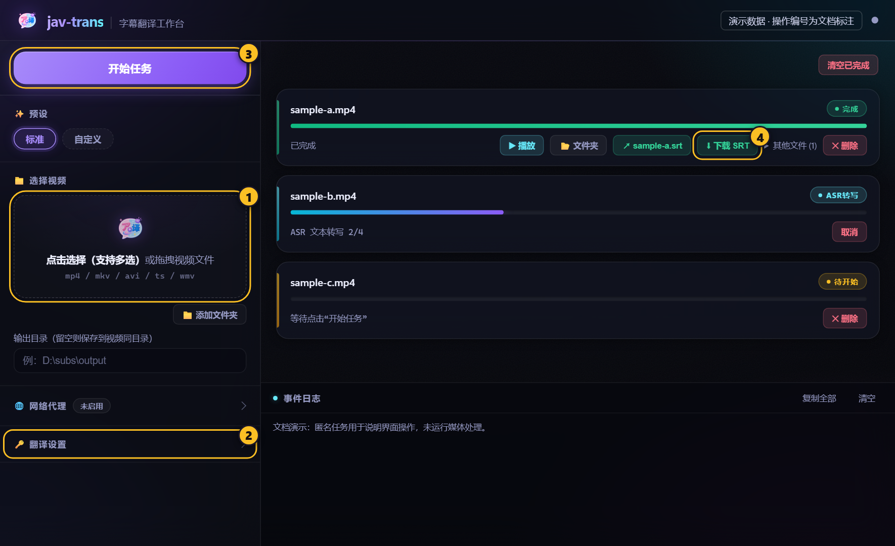
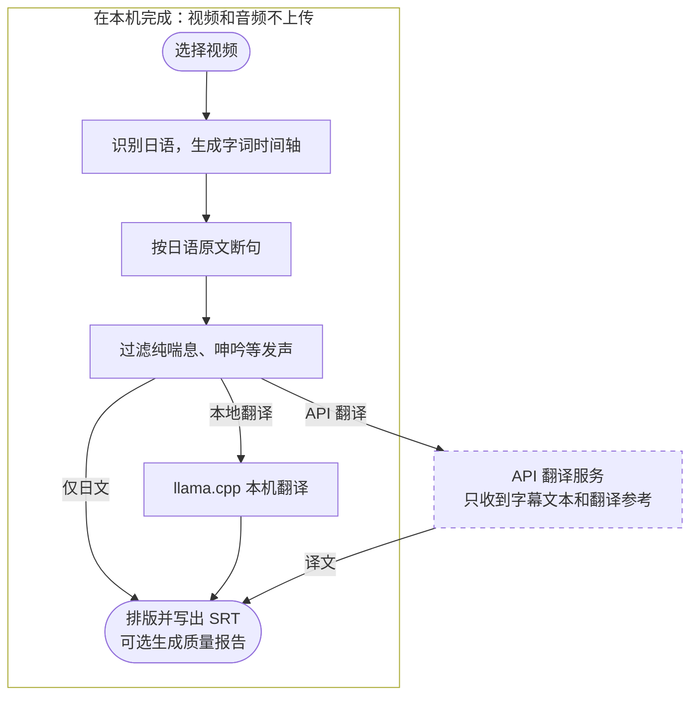
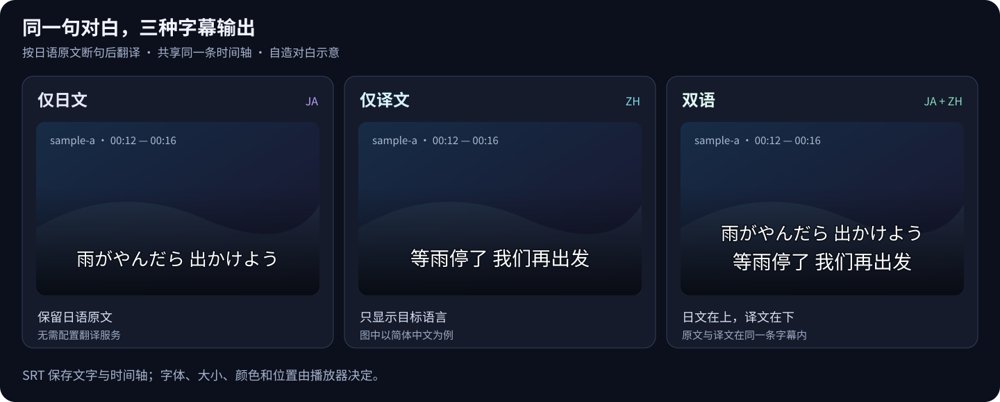
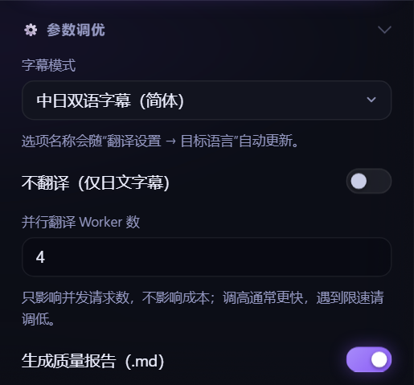
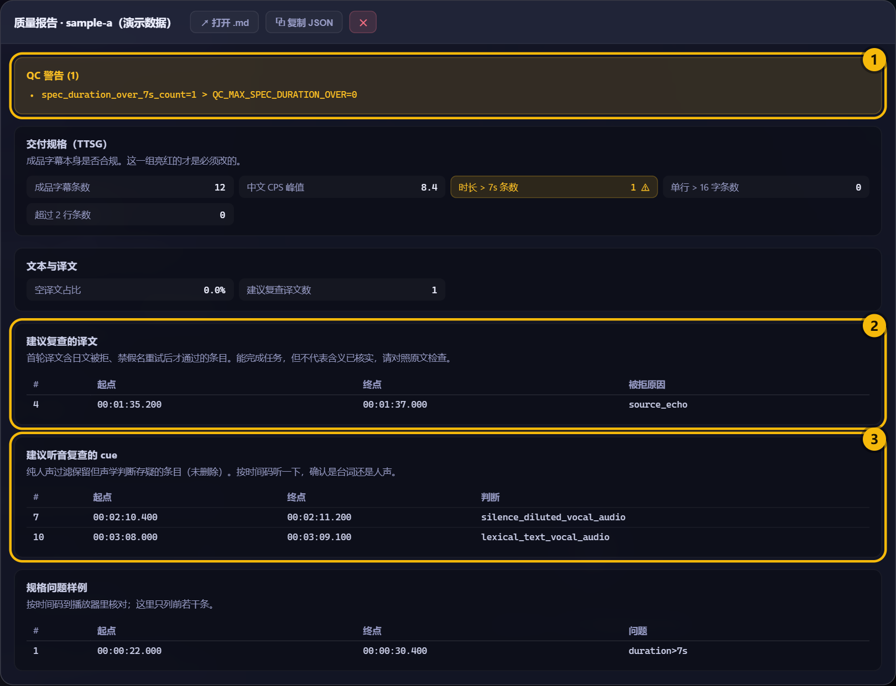

# jav-trans

**把 JAV 日语视频变成日文、译文或双语字幕。** 在本机控制台选好视频，程序会依次完成语音识别、时间轴对齐、翻译（可选）和字幕导出。

[**下载 Windows 发布包**](https://github.com/jaykwok/jav-trans/releases/latest/download/jav-trans-windows-x64.zip) · [版本说明](https://github.com/jaykwok/jav-trans/releases/latest) · [快速开始](#快速开始) · [模式选择](#选择处理模式) · [升级](#升级到新版本) · [常见问题](#常见问题)

适用于 **Windows 10/11 + NVIDIA 显卡**。视频和音频只在本机处理。仅日文和本地翻译模式不会向外发送字幕；API 翻译模式会把字幕文本和你填写的翻译参考发送到所选服务。

**字幕默认保存在视频所在的文件夹**（输出目录留空时），也可以在控制台另选输出目录。



*图为“标准”预设，①–④ 为文档标注，任务名称与数值均为演示数据。点击图片可查看大图。*

## 运行要求

| 项目 | 要求 |
| --- | --- |
| 系统 | Windows 10/11 |
| 显卡 | NVIDIA 独立显卡，至少 **8GB 物理显存** |
| 磁盘 | 解压到普通可写目录（不要放在 `C:\Program Files`），预留至少 **17 GB**，另需存放输出的空间 |
| 网络 | 首次准备环境和下载模型时需要联网；API 翻译全程需要联网 |

语音识别必须使用 CUDA。CUDA 不可用、驱动过旧或显存不足时，程序会直接报错，不会改用 CPU。

**耗时参考**：在 RTX 4060 Ti 8GB 上处理一部约 1 小时 50 分钟、266 条字幕的样片，识别与时间轴约 9 分钟，本地翻译（CUDA 版 llama.cpp）约 30–50 秒。以上不含首次下载，翻译耗时随字幕条数增加。

<details>
<summary><strong>发布包包含什么？哪些会自动下载？</strong></summary>

发布包约 100 MB，内含启动程序、程序代码、依赖清单和 FFmpeg Shared；运行环境和模型在用到时下载。

| 内容 | 如何准备 |
| --- | --- |
| FFmpeg | 已包含在发布包中，无需单独安装 |
| uv | 优先使用本机已有版本，没有时自动从 PyPI 下载 |
| Python、PyTorch 等依赖 | 首次启动时自动安装，约占 3.3 GB |
| 语音识别模型与对齐头 | 首次转录时下载，识别模型约 3.9 GB |
| 本地翻译模型 | 首次本地翻译时下载 Hy-MT2-7B Q6，约 6.2 GB |
| llama.cpp | 使用本地翻译时需要另行安装，见[本地翻译](#本地翻译) |
| API Key | 使用 API 翻译时自行填写 |

安装中断后，重新双击 `jav-trans.exe` 即可接着准备，已下载的部分不会重下。模型保存在程序目录的 `models\` 下，之后无需再次下载。

</details>

## 快速开始

1. **下载并启动。** 下载上方的 `jav-trans-windows-x64.zip`，解压后双击 `jav-trans.exe`。首次启动会测速并询问是否使用代理，然后自动安装运行环境，完成后程序窗口自动打开。
2. **添加视频。** 点击 **① 选择视频**，或直接拖入文件、添加文件夹；需要时指定输出目录。第一次建议先用短视频试一试。
3. **配置翻译。** 保持“标准”预设，展开 **② 翻译设置**，选择后端，按 [API 翻译](#api-翻译)或[本地翻译](#本地翻译)的步骤配置并保存。目标语言默认为简体中文。
4. **开始并查看结果。** 点击 **③ 开始任务**。首次转录会先下载识别模型和对齐头；任务显示“完成”后，在 **④ 结果区域**打开文件夹或下载 SRT。

标准预设使用默认任务参数，生成**仅译文字幕**。需要仅日文、双语字幕或质量报告时，见[自定义选项](#自定义选项)。

## 选择处理模式

| 模式 | 额外准备 | 是否向翻译服务发送文本 | 说明 |
| --- | --- | --- | --- |
| **API 翻译** | 支持 Responses 接口的服务与 API Key | 是 | 标准预设的默认后端，支持全片参考、角色参考和可选的语义复核 |
| **本地翻译** | llama.cpp；首次使用时下载翻译模型 | 否 | 字幕不出本机，没有 API 费用；7B 模型可能误判省略的主语，建议复查 |
| **仅日文** | 在[自定义选项](#自定义选项)中开启 | 否 | 只需要日文 SRT，或暂不配置翻译服务 |

### API 翻译

1. 在“翻译设置”中选择“API 调用（OpenAI 兼容）”。
2. 填写 API Key，默认服务为 OpenRouter。使用其他服务时，同时填写对应的 Base URL 并保存。
3. 点击模型旁的“获取”，选择该服务提供的模型；确认目标语言和推理强度后再次保存。

服务必须支持 **Responses 接口（`/responses`）**，只支持 Chat Completions 的接口无法使用。Base URL 与模型名必须配套，示例和结构化输出设置见 [API 配置与排错](docs/ADVANCED.md#api-翻译)。API 语义复核默认关闭，开启后会增加请求次数和等待时间，见[语义复核](docs/ADVANCED.md#语义复核)。

### 本地翻译

1. 在 PowerShell 中安装 llama.cpp：

   ```powershell
   winget install -e --id ggml.llamacpp
   ```

2. 在“翻译设置 → 翻译后端”中选择“本地翻译（Hy-MT2-7B Q6 · llama.cpp）”。
3. 通过 winget 安装的 `llama-server` 位于 `PATH` 上，程序会自动找到；手动解压的版本需要填写其所在文件夹或 exe 路径。
4. 选择目标语言，保存翻译设置后开始任务。翻译模型 `HY-MT2-7B-Q6_K.gguf` 会在首次翻译时自动下载。

winget 安装的是 Vulkan 版；在 NVIDIA 显卡上，CUDA 版更快，手动安装方法见[本地翻译配置](docs/ADVANCED.md#本地翻译)。

本地模型参考邻近原文翻译，仍可能误判被省略的人物或动作，在限定范围（如「今日だけ」）和应答词（如「ううん」）上也容易误译，建议复查。

## 处理流程


```mermaid
flowchart TD
    subgraph local["在本机完成：视频和音频不上传"]
        A(["选择视频"]) --> B["识别日语，生成字词时间轴"]
        B --> C["按日语原文断句"]
        C --> D["过滤纯喘息、呻吟等发声"]
        D -->|本地翻译| G["llama.cpp 本机翻译"]
        D -->|仅日文| W
        G --> W(["排版并写出 SRT<br>可选生成质量报告"])
    end
    D -->|API 翻译| H["API 翻译服务<br>只收到字幕文本和翻译参考"]
    H -->|译文| W
    style local fill:none
    style H stroke-dasharray: 5 5
```

*框内步骤都在本机完成；只有选择 API 翻译时，字幕文本和翻译参考才会发送到框外的翻译服务。*

- **先按日文断句，再翻译。** 优先保持完整句；过长的句子只在完整分句和实测停顿处拆开。译文沿用日文单元的时间轴，中文换行不会拆出新的字幕条目。
- **保留对白，过滤非语义人声。** 结合文本与声学特征，删除纯喘息、呻吟等非语义发声；只要含有可辨识的词语就会保留。
- **失败不必从头再来。** 重新运行时复用仍然有效的识别和翻译缓存；只是保存或导出失败时，可以单独重试这一步。

## 字幕效果



*排版示意使用自造对白，三个画面对应三种可选输出。SRT 只保存文字和时间轴，字体、大小、颜色和位置由播放器决定。*

日文和中文字幕分别按 Netflix 对应语言的字幕规范排版，每轨最多两行；日文的句号、顿号和中文的逗号、句号按规范改为空格。完整表意优先于行长：找不到可靠断点的长句会保持完整，并标出布局风险。

标准预设输出图中的“仅译文”。双语字幕日文在上、译文在下。播放器没有自动加载字幕时，手动打开对应的 SRT 文件即可。

## 自定义选项

需要调整输出类型或生成报告时，点击“**自定义**”，再展开“**参数调优**”。



*自定义界面节选，以“双语字幕 + 质量报告”为例。使用标准预设时无需调整这些参数。*

| 想要的结果 | 如何设置 |
| --- | --- |
| 仅日文字幕 | 开启“不翻译（仅日文字幕）”，无需配置翻译服务 |
| 双语字幕 | 关闭“不翻译”，在“字幕模式”中选择双语选项；选项名称随目标语言变化 |
| 质量报告 | 在开始任务前开启“生成质量报告（.md）” |

设置好后，可点击“保存自定义任务模板”记住这些选项。翻译服务仍在“翻译设置”中配置；切回“标准”会恢复默认任务参数。

## 质量报告

开始任务前，在“**自定义 → 参数调优**”中开启“**生成质量报告（.md）**”。任务完成后，点击任务卡上的“**质检**”查看。



*质量报告界面，使用自造演示数据。① 查看触发的警告；② 对照原文核对建议复查的译文；③ 按时间码听一下存疑的 cue。其余问题同样可按时间码到播放器中复查。*

报告列出时间轴、阅读速度、排版和译文方面的风险，供人工判断，并单独列出两类建议复查的字幕：

- **建议复查的译文**：本地翻译中，首轮含有日文、禁用假名重试后才通过的译文。
- **建议听音复查的 cue**：过滤时保留下来、但声学判断存疑的条目。

报告只提示风险，不保证每条字幕都正确；开启报告也不会顺带开启需要付费的 API 语义复核。

## 输出与隐私

- **字幕在哪里？** SRT 导出到所选输出目录：仅日文模式生成 `sample-a.ja.srt`，译文和双语模式生成 `sample-a.srt`。也可以从任务卡直接打开或下载。
- **删除任务会删掉字幕吗？** 不会。`tmp/outputs/` 中已提交的结果和已导出的 SRT 都会保留。`tmp/outputs/` 是正式结果目录，不要当作普通缓存清理。
- **哪些内容会联网？** 下载模型和依赖；API 翻译会发送字幕文本和你填写的翻译参考，数据如何处理取决于所选服务。视频和音频不会上传。
- **能接着上次做吗？** 能，有效缓存会保留。任务进行中切换翻译后端或本地 server 路径，会让受影响的任务停止；保存新设置后重新运行即可。

目录用途、结果清理和保存失败后的处理见[结果与恢复](docs/ADVANCED.md#结果与恢复)。

## 升级到新版本

1. 关闭程序窗口。
2. 打开新版压缩包，进入其中的 `jav-trans` 文件夹，全选里面的文件和文件夹，复制到旧版程序文件夹中；提示同名文件时选择“替换”。也可以直接把压缩包解压到旧版 `jav-trans` 文件夹的**上一级**目录。
3. 双击 `jav-trans.exe`。如果新版改了依赖，启动时会显示“更新运行环境”，只下载有变化的部分。

运行环境、模型、设置（`.env`）、任务记录和已导出的字幕都会保留，无需重新下载。新版本不再使用的旧程序文件会在启动时移到 `tmp\upgrade-leftovers\`，确认新版本运行正常后可以删除。

不要把压缩包里的 `jav-trans` 文件夹整个放进旧版文件夹：这会形成两层目录，内层会重新安装环境、重新下载模型。启动时检测到这种情况会先询问。

## 常见问题

| 遇到的情况 | 处理方法 |
| --- | --- |
| 程序窗口打不开 | 在程序目录运行 `.\jav-trans.exe --doctor` 自检，见[启动与下载](docs/ADVANCED.md#启动与下载) |
| 下载慢或无法连接 | 在“网络代理”中填写代理，或启动时加 `--proxy`，见[启动与下载](docs/ADVANCED.md#启动与下载) |
| CUDA 或显存报错 | 关闭其他占用显卡的程序，检查驱动与显存，见[显卡与取消](docs/ADVANCED.md#显卡与取消) |
| API 报错、模型不可用 | 核对 Key、Base URL、模型及 Responses 支持，见 [API 翻译](docs/ADVANCED.md#api-翻译) |
| 译文有明显错误 | 开启[质量报告](#质量报告)，优先核对“建议复查的译文”；本地模型的常见误译见[本地翻译](#本地翻译)，也可以改用 [API 翻译](#api-翻译) |
| 升级后要重新下载模型 | 新版没有复制到旧版程序文件夹（解压到了别处，或被放进了旧版文件夹里面），按[升级到新版本](#升级到新版本)重新操作 |
| 卡在“停止中”或提示 GPU 未释放 | 按提示条等待清理，必要时点“重新检查”或“重试清理”，见[显卡与取消](docs/ADVANCED.md#显卡与取消) |
| 保存、提交或导出失败 | 点任务卡上对应的重试按钮，无需重新识别和翻译，见[结果与恢复](docs/ADVANCED.md#结果与恢复) |

### 设置填错了会怎样

一般的数字和开关设置留空或无法解析时使用默认值，解析失败会提示字段名；数字越界时按设置类型限制到边界或恢复默认值。只接受固定取值的设置填错会直接报错。完整规则与示例见[配置校验](docs/ADVANCED.md#配置校验)。

## 从源码运行

使用 Windows 发布包时无需这一步。开发者从源码运行需要 Git、uv 和 FFmpeg Shared，并按项目的锁定配置安装依赖，完整命令见[从源码运行](docs/ADVANCED.md#从源码运行)。

## 更多文档

- [进阶设置与排错](docs/ADVANCED.md)
- [反馈问题前需要准备什么](docs/ADVANCED.md#反馈问题)
- [模型目录说明](models/README.md)
- [打包说明](packaging/README.md)
- [历史与实验记录](docs/HISTORY.md)

致谢：[WhisperJAV](https://github.com/meizhong986/WhisperJAV) 为本项目早期路线提供了重要参考。
